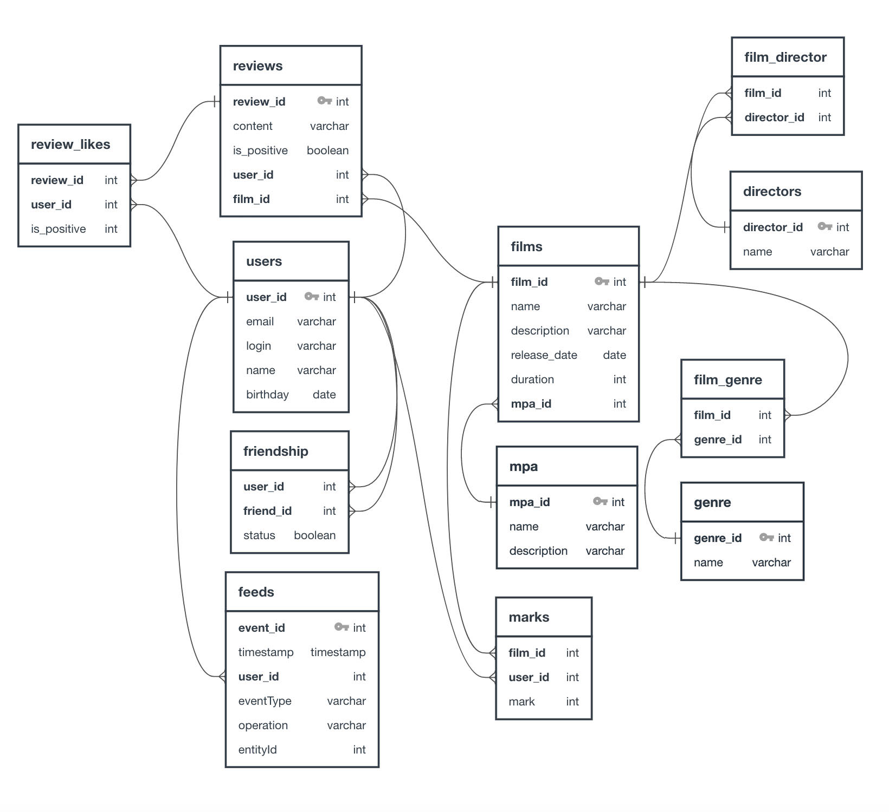

# Групповой проект группы #4

* * *

## Участники:

* Трофимова Мария **/ тимлид**
* Куликова Дарья
* Двоеглазов Алексей
* Морозов Илья
* Силин Иван

* * *
## Функциональность

### Режиссеры
В информацию о фильмах добавлен список режиссёров (например, сестры Вачовски). 
#### Добавлена функциональность:
1. Вывод всех фильмов режиссёра, отсортированных по количеству лайков.
2. Вывод всех фильмов режиссёра, отсортированных по годам.
3. Вывод списа всех режиссёров
4. Получение режиссёра по id
5. Создание режиссёра
6. Изменение режиссёра
> За создание функциональности отвечает: Куликова Дарья

### Отзывы
В приложении добавлены отзывы на фильмы.
Характеристики отзыва.
1. Оценка — полезно/бесполезно.
2. Тип отзыва — негативный/положительный.
3. Рейтинг (рассчитывается из оценок пользователей), отзывы сортируются по рейтингу 
#### Добавлена функциональность:
1. Добавление нового отзыва.
2. Редактирование уже имеющегося отзыва.
3. Удаление уже имеющегося отзыва.
4. Получение отзыва по идентификатору.
5. Получение всех отзывов по идентификатору фильма (если  не указан то все). Если кол-во не указано то 10.
6. Возможность поставить и удалить лайк / дизлайк отзыву.
>За создание функциональности отвечают: Двоеглазов Алексей, Трофимова Мария

### Лента событий
Добавлена возможность просмотра последних событий на платформе — добавление в друзья, удаление из друзей, лайки и отзывы, которые оставили друзья пользователя.
> За создание функциональности отвечает: Силин Иван

### Рекомендации
Реализована простая рекомендательную система для фильмов.
> За создание функциональности отвечает: Морозов Илья, Трофимова Мария

### Общие фильмы
Реализован вывод общих с другом фильмов с сортировкой по их популярности.
> За создание функциональности отвечает: Трофимова Мария

### Удаление фильмов и пользователей
Добавлена функциональность для удаления фильма и пользователя по идентификатору.
> За создание функциональности отвечает: Трофимова Мария

### Вывод самых популярных фильмов по жанру и года
Добавлена возможность выводить топ-N фильмов по количеству лайков с фильтрацией по двум параметрам:
1. По жанру.
2. За указанный год.
> За создание функциональности отвечает: Трофимова Мария

### Поиск
Реализован поиск по названию фильмов и по режиссёру по подстроке
> За создание функциональности отвечает: Трофимова Мария

### *** Рефакторинг: лайки → оценки
#### Подзадачи:
- Замена likes на marks
> За рефакторинг отвечает: Двоеглазов Алексей
- Обновление методов сортировки по популярности
> За рефакторинг отвечает: Силин Иван
- Обновленный метод для рекомендаций
> За рефакторинг отвечает: Трофимова Мария

# ER-диаграмма

[Ссылка на диаграмму](src/main/resources/static/filmorateER.jpg)\
[Ссылка на диаграмму в редакторе диаграмм](https://app.quickdatabasediagrams.com/#/d/avNQfe)
